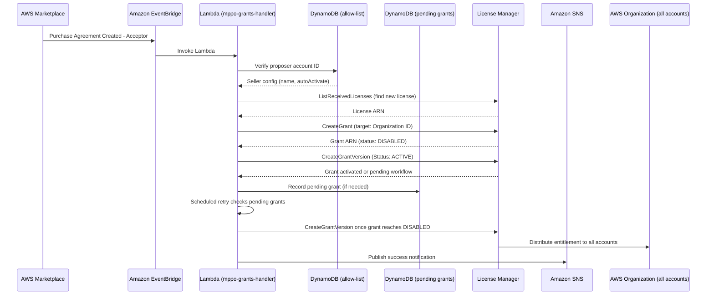

# Automate model subscriptions with managed entitlements for Amazon Bedrock

A sample implementation that automates the distribution of [managed entitlements for Amazon Bedrock](https://docs.aws.amazon.com/bedrock/latest/userguide/managed-entitlements.html) across your AWS Organization. Deploy this in your management account to automatically create and activate License Manager grants whenever a new Marketplace private offer is accepted - eliminating manual per-account grant management.

> **This is a sample.** It is intended as a starting point for customers to review, adapt, and extend to meet their own security, compliance, and operational requirements. See [Security](#security) for shared responsibility guidance.

## Challenge

When you negotiate private pricing for a model through an [AWS Marketplace private offer](https://docs.aws.amazon.com/marketplace/latest/buyerguide/buyer-private-offers.html), the subscription and its associated license are tied to a single account. Every other account in your organization needs its own subscription to access that model at the negotiated rate - creating procurement overhead and compliance gaps.

```
Management account ──── ✅ Subscribed (negotiated rate)
Dev account ─────────── ❌ No access
Staging ─────────────── ❌ No access  
Production ──────────── ❌ No access
```

Even when you manually distribute grants via AWS License Manager, those grants land in a **Disabled** state by default. Until explicitly activated, accounts are billed at **public list pricing** - not the rate you negotiated. This is the silent billing blocker.

## Solution

[Managed entitlements for Amazon Bedrock](https://docs.aws.amazon.com/bedrock/latest/userguide/managed-entitlements.html) solves the distribution problem: subscribe once, create a single grant targeting your Organization ID, and every member account inherits access automatically.

This sample automates the grant distribution step so you never have to manually create or activate grants again:

1. **Listens** for new Marketplace agreement events via Amazon EventBridge
2. **Verifies** the seller is in your allow-list
3. **Discovers** the license created by the subscription
4. **Creates and activates** an organization-wide grant (addressing the Disabled→Active gotcha)
5. **Retries activation asynchronously** if License Manager is still processing the grant
6. **Notifies** your team via Amazon SNS

📎 **Reference**: [Managed entitlements for Bedrock slides](https://wirjo.github.io/slides/bedrock-managed-entitlements/)

---

## Choose Your Path

This repo has **two independent ways** to fix the Disabled→Active grant problem. Pick one:

| | [`lightweight/`](lightweight/) | This repo's CDK automation (below) |
|---|---|---|
| **What it is** | One script, run once | EventBridge + Lambda + DynamoDB, deployed via CDK |
| **Setup** | None — clone and run | `cdk deploy` + config file |
| **Scope** | Every received license (no allow-list) | Only sellers in your allow-list |
| **Reacts to new offers automatically?** | No — re-run manually | Yes |
| **Choose this if…** | You want the fastest fix, no infra, and trust everything currently in `ListReceivedLicenses` | You want ongoing, hands-off automation with per-seller control |

→ **Want the lightweight script?** Go straight to [`lightweight/README.md`](lightweight/README.md) — nothing else in this repo is required.

→ **Want the full automation?** Keep reading below.

---

## Getting Started

### Prerequisites

This stack must be deployed in your **AWS Organizations management account** in **`us-east-1`**.

Before deploying, verify:

1. **AWS Organizations - "All Features" Enabled**
   - Open [AWS Organizations console](https://console.aws.amazon.com/organizations/) → Settings
   - Must say "All features" (not "Consolidated billing" only)
   - This script checks the setting, but does not enable it automatically because AWS Organizations might need member account handshakes.

2. **Development Tools** - AWS CDK v2, Python 3.12+, AWS CLI with management account credentials

3. **License Manager and Marketplace organization integration**
   - Run the bootstrap check from the management account in `us-east-1`:

```bash
python3 scripts/bootstrap_prereqs.py --check --region us-east-1
```

   - If the check reports `APPLY` items, review them before making changes. Apply mode can enable organization-wide License Manager and Marketplace settings, so you must confirm the current AWS account ID:

```bash
python3 scripts/bootstrap_prereqs.py \
  --apply \
  --region us-east-1 \
  --confirm-account-id 123456789012
```

   - This can enable License Manager organization integration and AWS Marketplace trusted access. It also checks the service-linked roles used by License Manager and Marketplace license management.
   - If you use a License Manager delegated administrator account, pass and confirm it explicitly:

```bash
python3 scripts/bootstrap_prereqs.py \
  --apply \
  --region us-east-1 \
  --confirm-account-id 123456789012 \
  --delegated-admin-account-id 222233334444 \
  --confirm-delegated-admin-account-id 222233334444
```

### Deploy

```bash
# Clone
git clone https://github.com/aws-samples/sample-bedrock-managed-entitlements.git
cd sample-bedrock-managed-entitlements

# Verify or enable License Manager and Marketplace org prerequisites
python3 scripts/bootstrap_prereqs.py --check --region us-east-1

# Review the output, then apply only after confirming the target account
python3 scripts/bootstrap_prereqs.py \
  --apply \
  --region us-east-1 \
  --confirm-account-id ACCOUNT_ID

# Configure (interactive - auto-discovers org ID and licenses)
python3 scripts/setup_config.py

# Or configure manually:
# cp config/sellers.example.json config/sellers.json && edit config/sellers.json

# Deploy
cd cdk && pip install -r requirements.txt
cdk bootstrap aws://ACCOUNT_ID/us-east-1  # first time only
cdk deploy

# Seed DynamoDB with your allowed sellers
cd .. && python scripts/seed_sellers.py --config config/sellers.json
```

### Configuration

**Interactive setup (recommended):**

```bash
python3 scripts/setup_config.py
```

Auto-discovers your Organization ID, lists existing licenses, and generates config interactively.

**Manual config** (`config/sellers.json`):

```json
{
  "organizationId": "o-xxxxxxxxxx",
  "allowedSellers": [
    {
      "name": "Anthropic",
      "proposerAccountId": "123456789012",
      "issuerName": "AWS/Marketplace",
      "productSkus": ["prod-example"],
      "autoActivateGrant": true
    }
  ],
  "notifications": {
    "emailAddresses": ["admin@example.com"],
    "slackWorkspaceId": "",
    "slackChannelId": ""
  }
}
```

`productSkus` and `productNames` are optional filters used by `scripts/backfill_grants.py` to avoid broad issuer-only matches when processing existing licenses.

### Notifications

**Email** - add addresses to `notifications.emailAddresses`. Subscriptions are created automatically.

**Slack** (via [AWS Chatbot](https://docs.aws.amazon.com/chatbot/latest/adminguide/what-is.html)) - add your Slack workspace and channel IDs:

```json
"notifications": {
  "slackWorkspaceId": "T01ABCDEF",
  "slackChannelId": "C01ABCDEF"
}
```

To find these:
1. [Set up AWS Chatbot with Slack](https://docs.aws.amazon.com/chatbot/latest/adminguide/slack-setup.html) (one-time: authorize the AWS Chatbot app in your Slack workspace)
2. Workspace ID: visible in AWS Chatbot console after authorization
3. Channel ID: right-click the Slack channel → "Copy link" → the `C01...` segment is the channel ID

When configured, grant creation/activation events and errors are posted directly to your Slack channel.

**Finding the seller account ID:**

```bash
# From existing licenses
aws license-manager list-received-licenses --region us-east-1 \
    --query 'Licenses[].{Product:ProductName,Issuer:Issuer.Name}' --output table

# From existing agreements
aws marketplace-agreement search-agreements --catalog AWSMarketplace \
    --query 'AgreementViewSummaries[].{Id:AgreementId,Proposer:ProposerAccountId}' --output table

# Your Organization ID
aws organizations describe-organization --query 'Organization.Id' --output text
```

---

## How It Works

### Architecture



### Grant Targeting

By default, grants target the **entire organization**. For granular control, add `grantTargets`:

| Target | Config | Use Case |
|--------|--------|----------|
| Organization (default) | Omit `grantTargets` | All current and future accounts |
| OU | `{"type": "ou", "id": "o-abc/ou-abc1-123"}` | Segmented rollout (e.g., prod OU first) |
| Account | `{"type": "account", "id": "111122223333"}` | Specific teams only |

```json
{
  "name": "Anthropic",
  "proposerAccountId": "123456789012",
  "grantTargets": [
    { "type": "ou", "id": "o-abc123/ou-abc1-12345678" },
    { "type": "account", "id": "999988887777" }
  ]
}
```

> **Note:** Account-level grants require the recipient to accept before activation (unlike org/OU grants which auto-accept).

### Grant Activation

Grants auto-accept but land in **Disabled** state. Until explicitly activated, accounts pay public list pricing.

This automation activates grants automatically via `CreateGrantVersion(Status=ACTIVE)`.

When creating the grant, the automation derives `AllowedOperations` from the parent License Manager grant when License Manager exposes that metadata. If the parent grant cannot be read, it falls back to the default Bedrock Marketplace operation set.

License Manager can take hours or days to move a newly created grant through workflow states before it becomes activatable. If the first Lambda invocation sees the grant still processing, it records the grant in `mppo-pending-grants`. A scheduled retry rule (`mppo-grant-activation-retry`, every 6 hours) keeps checking the grant and activates it once License Manager reports `DISABLED`.

### Backfill Existing Licenses

EventBridge automation handles new Marketplace agreement events. For licenses accepted before you deployed this sample, you have two options depending on how much control you want:

**Allow-list scoped (recommended default):** reuses your `config/sellers.json` allow-list, so only licenses from sellers you've already vetted are touched.

```bash
python3 scripts/backfill_grants.py --config config/sellers.json
```

Backfill is allow-list scoped and dry-run by default. Because License Manager received licenses do not reliably expose the Marketplace proposer account ID, the script refuses broad issuer-only matching. Narrow the run by passing explicit `--license-arn` values, or add `productSkus` or `productNames` to the relevant seller config.

```bash
python3 scripts/backfill_grants.py \
  --config config/sellers.json \
  --license-arn arn:aws:license-manager::123456789012:license:l-example \
  --apply \
  --confirm-account-id 123456789012
```

**Lightweight, no config file:** if you don't want to maintain `config/sellers.json` at all — e.g. a one-off bootstrap where you're comfortable distributing *every* received license — use the standalone script in [`lightweight/`](lightweight/) instead of anything in this section. See [Choose Your Path](#choose-your-path) above and [`lightweight/README.md`](lightweight/README.md) for full usage; it doesn't require anything else in this repo.

### Legacy Offer Cleanup

Set `"replaceLegacyGrants": true` to automatically disable old per-account grants when activating the new org-wide grant. Uses `ActivationOverrideBehavior: ALL_GRANTS_PERMITTED_BY_ISSUER`.

Default (`false`): new grant activates without affecting existing grants.

### Auto-Accept Offers (Optional)

⚠️ **RISK: Auto-accept creates financial commitments automatically.** Only enable for sellers with pre-negotiated terms you are comfortable accepting without manual review.

When enabled, a scheduled Lambda lists private offers visible to this account via the [Marketplace Discovery API](https://docs.aws.amazon.com/marketplace/latest/developerguide/use-apis-as-buyer.html) (`ListPurchaseOptions` + `GetOffer` + `GetOfferTerms`), matches them against trusted sellers in the allow-list, and accepts matching offers via the Marketplace Agreement API (`CreateAgreementRequest` + `AcceptAgreementRequest`). The existing grant automation then distributes the license.

> Unaccepted private offers aren't modeled as agreements in the Marketplace Agreement API — an agreement only exists after acceptance. Discovery therefore goes through `marketplace-discovery`, not `SearchAgreements`.

**Two-level opt-in required:**
1. Global: `"enableAutoAccept": true` in config (deploys the Lambda)
2. Per-seller: `"autoAcceptOffers": true` plus a `sellerProfileId` (opts in that seller)

```json
{
  "enableAutoAccept": true,
  "autoAcceptSchedule": "rate(1 hour)",
  "allowedSellers": [{
    "name": "Anthropic",
    "proposerAccountId": "123456789012",
    "sellerProfileId": "prof-xxxxxxxxxxxx",
    "autoAcceptOffers": true
  }]
}
```

**How offers are authorized.** `GetOffer` identifies a seller by two fields: `sellerProfileId`, a unique AWS-assigned identifier, and `displayName`, a seller-chosen human-readable string. Display names are not unique, so authorization keys exclusively on `sellerProfileId` — `displayName` is used only in logs and notifications.

Trusted profile IDs are passed to `ListPurchaseOptions` as a `SELLER_OF_RECORD_PROFILE_ID` filter so offers from other sellers are never returned, then re-checked after `GetOffer`. A seller with `autoAcceptOffers` but no `sellerProfileId` never auto-accepts; the Lambda notifies admins instead of falling back to a name match.

Find a seller's profile ID on the offer in the AWS Marketplace console, then add it to `config/sellers.json` and re-run `scripts/seed_sellers.py`.

> The seller's AWS account ID isn't available before acceptance — `sellerOfRecord` doesn't carry one. After each acceptance the Lambda calls `DescribeAgreement` and compares `proposer.accountId` against the record's `proposerAccountId`, alerting on a mismatch as an audit signal (the agreement already exists by then, so this confirms rather than blocks).

**When to use:** Ongoing relationship with seller, consistent terms across models, budget pre-approved.
**When NOT to use:** Variable pricing, compliance requires manual approval, offer terms may change.

---

## Verifying & Testing

### Verifying Discounts

After grants are activated, verify the negotiated rate is flowing:

```bash
# From member account (CloudShell - zero setup)
python3 scripts/bedrock_discount_check.py --issuer "Anthropic, PBC"

# From management account (scope billing to a member)
python3 scripts/bedrock_discount_check.py --issuer "Anthropic, PBC" --linked-account 222233334444
```

See [`scripts/README.md`](scripts/README.md) for full usage.

### Testing Without Live Offers

```bash
# Unit tests (32 passing - mocked AWS services)
pip install -r requirements-dev.txt && pytest tests/ -v

# Invoke the handler locally with an EventBridge-shaped payload
python scripts/simulate_event.py --seller-account 123456789012

# Invoke the deployed Lambda with an EventBridge-shaped payload
python scripts/simulate_event.py --seller-account 123456789012 --live
```

### E2E Validation

```bash
# Validate all deployed infrastructure
python scripts/e2e_validate.py --org-id o-xxxxxxxxxx --seller-account 444455556666 --simulate
```

---

## Security

### Shared Responsibility Model

This sample deploys infrastructure into **your** AWS account. Under the [AWS Shared Responsibility Model](https://aws.amazon.com/compliance/shared-responsibility-model/):

| Responsibility | Owner |
|---------------|-------|
| Infrastructure security (compute, network, storage) | AWS |
| IAM policies and access control | You |
| Configuration of the allow-list (which sellers to trust) | You |
| Enabling/disabling auto-accept and understanding its risks | You |
| Monitoring grant status and billing rates | You |
| Secrets management and credential rotation | You |
| Compliance with your organization's procurement policies | You |

**This is a sample** - review and adapt it to your organization's security requirements before production use.

### IAM Permissions (Least Privilege)

```yaml
# Grant distribution Lambda
- license-manager:ListReceivedLicenses
- license-manager:CreateGrant
- license-manager:CreateGrantVersion
- license-manager:GetGrant
- license-manager:ListDistributedGrants
- aws-marketplace:DescribeAgreement
- aws-marketplace:SearchAgreements
- dynamodb:GetItem (config table only)
- sns:Publish (notification topic only)
- sts:GetCallerIdentity
- organizations:DescribeOrganization
- organizations:ListAccounts

# Auto-accept Lambda (only deployed if enabled)
- aws-marketplace:ListPurchaseOptions
- aws-marketplace:GetOffer
- aws-marketplace:GetOfferTerms
- aws-marketplace:CreateAgreementRequest
- aws-marketplace:AcceptAgreementRequest
- aws-marketplace:DescribeAgreement
```

### Key Security Considerations

- The **DynamoDB allow-list** is the gatekeeper - only sellers in this table trigger automation
- Seller identity is matched on **AWS-assigned IDs** (`proposerAccountId` for grants, `sellerProfileId` for auto-accept), never on a seller-supplied display name
- **Auto-accept** is disabled by default and requires two explicit opt-ins
- All actions are logged to **CloudTrail** for audit
- **SNS notifications** provide visibility into every automated action
- The Lambda has **no write access** to License Manager beyond grant creation/activation

---

## Reference

### Validation Status

| Layer | Status | Method |
|-------|--------|--------|
| EventBridge event schema | ✅ Validated | Matched against [official AWS docs](https://docs.aws.amazon.com/marketplace/latest/buyerguide/agreement-eventbridge.html) |
| License Manager API calls | ✅ Validated | `CreateGrant`, `CreateGrantVersion` verified against [API Reference](https://docs.aws.amazon.com/license-manager/latest/APIReference/); grant activation live-tested against an ISV Partner private offer |
| Marketplace Discovery API calls | ✅ Validated | `ListPurchaseOptions`, `GetOffer`, `GetOfferTerms` live-tested against the real API (params, IAM permissions) |
| Marketplace Agreement accept calls | ⚠️ Shape-validated | `CreateAgreementRequest`, `AcceptAgreementRequest` verified against API Reference and IAM policy simulation; not yet exercised against a live unaccepted offer |
| Lambda handler logic | ✅ Validated | 32 unit/integration tests (moto + fakes) |
| CDK infrastructure | ✅ Validated | CDK assertion tests, incl. auto-accept Lambda when `enableAutoAccept: true` |

### Cost Estimate

This stack costs effectively **$0/month at rest**. You only pay when a private offer event fires.

| Resource | Cost | Notes |
|----------|------|-------|
| Lambda (grant handler) | ~$0 | Free tier: 1M requests/month. Invoked only on new agreements (rare). |
| Lambda (auto-accept, if enabled) | ~$0 | One invocation per schedule interval (e.g., hourly = 720/month). |
| DynamoDB (seller allow-list) | ~$0 | On-demand pricing. Single-digit items, minimal reads. |
| EventBridge | $0 | No charge for AWS service events or rules. |
| SNS | ~$0 | Free tier: 1,000 email notifications/month. |
| AWS Chatbot (Slack) | $0 | No additional charge. |
| CloudWatch Logs | ~$0.50 | 2-week retention. Minimal log volume. |

**Estimated total: < $1/month** under normal usage (a few private offers per month).

No NAT Gateways, no VPCs, no always-on compute. The stack is entirely serverless and event-driven.

### FAQ

**Is a subscription per model?** Yes. Each model needs its own subscription. This automation handles the grant step, but per-model subscription is inherent.

**Which account do I deploy from?** The management account. Only it can create org-wide grants.

**What if my org uses "consolidated billing" only?** You're limited to account-level grants. Enable "all features" in Organizations.

**What about old per-account grants?** Set `replaceLegacyGrants: true` to auto-replace them.

**How do I verify the discount is working?** Run `scripts/bedrock_discount_check.py`.

### License

MIT-0 - See [LICENSE](LICENSE)
